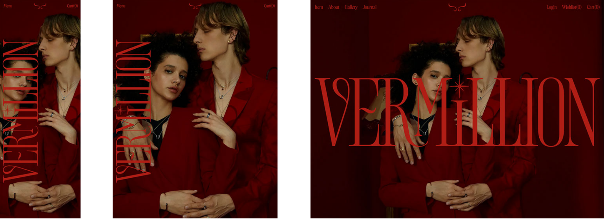
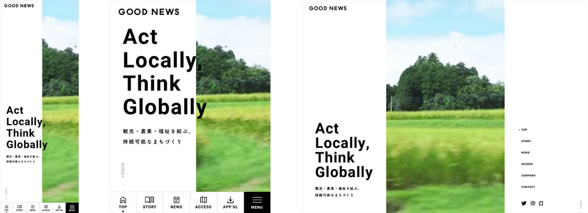

# 반응형 디자인 정리

## 반응형이란?

### 결론

사이트가 보여지는 장치의 요구와 기능에 대응하도록 사이트를 만드는 방법입니다.

- https://www.w3schools.com/Css/tryresponsive_col-s.htm

<video width="50%" height="50%" controls>
  <source src="https://storage.googleapis.com/web-dev-uploads/video/tcFciHGuF3MxnTr1y5ue01OGLBn2/8RKRFvbuoXGkOSuEArb7.mp4" type="video/mp4">
</video>

<video width="50%" height="50%" controls>
  <source src="https://storage.googleapis.com/web-dev-uploads/video/HodOHWjMnbNw56hvNASHWSgZyAf2/3KENjI9FiNARctTiKDak.mp4" type="video/mp4">
</video>

### 개요

반응형은 이하와 같은 성질이 있습니다.

1. 유동적 레이아웃, 컨테이너
2. 유동적 이미지, 영상
3. 미디어 쿼리를 이용한 레이아웃 변경

## 반응형 예시

- 반응형 예제 사이트

  - https://haajapan.com/
  - https://cloud-dental-clinic.com/
  - https://gooooodnews.com/
  - https://vermillion-jewelry.com/
  - https://work.vilmarfernandes.com/
  - https://web.dev/learn/design/macro-layouts/
  - https://www.orbis.co.jp/brand/orbis_u/trial/?adid=brand_top_bnr

## vh, vw에 대한 의견

- vh, vw의 활용하는 대부분은 레이아웃 **폭**을 잡거나 폰트크기에(`vw` 활용) 이용했습니다.
- **페이지 전체(레이아웃 및 요소 등)**를 vw, vh로 구성하는 곳은 찾지 못했습니다.

## 참조

- https://developer.mozilla.org/ko/docs/Learn/CSS/CSS_layout/Responsive_Design
- https://web.dev/i18n/ko/responsive-web-design-basics/
- https://www.w3schools.com/Css/css_rwd_intro.asp
